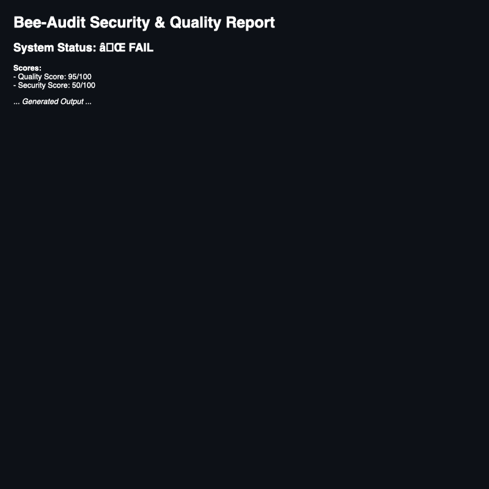

# Bee-Audit

[](./LICENSE)
[](#)
[](#)

> Unified security and quality gate for JavaScript/TypeScript repositories and monorepos.

Bee-Audit helps you answer one hard question before you trust or merge code:

> **Is this repository healthy and safe enough to ship?**

Instead of relying on one tool, Bee-Audit orchestrates multiple scanners — linting, type checks, tests, secrets scanning, dependency audits, SAST (Semgrep), and (soon) runtime security and business-logic checks — into **one pipeline, one report, and one pass/warn/fail decision.**

---

## Why Bee-Audit?

Modern JS/TS projects typically rely on a mix of tools:

- ESLint for style
- Jest/Vitest/Playwright for tests
- Gitleaks for secrets
- npm/yarn audit for dependencies
- Semgrep / Sonar / CodeQL for SAST
- ZAP / DAST tools for runtime checks

Each produces its own output, often in different places, with different severity models.

**Bee-Audit does not try to replace these tools.**  
It focuses on:

- Running them **consistently** (locally and in CI)
- **Normalizing** their outputs
- Applying a **policy engine** on top
- Producing **one human-readable dashboard** and **one machine-readable JSON** for automation.

This makes Bee-Audit useful for:

- Pre-merge quality and security gates
- Auditing client repositories
- Monorepo hygiene checks
- Security reviews for JS/TS projects

---

## Features

- 🧩 **Unified CLI** for auditing any GitHub repository
- 🔁 **GitHub Actions workflows** for automatic checks on PRs and pushes
- 📂 **Monorepo-aware detection** (`pnpm`, `turbo`, `nx`, `apps/*`, `packages/*`)
- 🧹 **Static & hygiene checks**
  - Lint (when available)
  - Type-check (when TypeScript present)
  - Tests (when configured)
- 🕵️‍♂️ **Secrets scanning**
  - Gitleaks integration (repo + git history)
- 🧪 **Dependency risk auditing**
  - npm / yarn / pnpm audit parsing
- 🛡 **SAST (Static Application Security Testing)**
  - Internal baseline SAST (pattern-based)
  - Semgrep CE integration (JS/TS + security rules)
- ⚖️ **Policy engine**
  - Configurable thresholds (secrets, vulns, test failures)
  - Security/Quality/Dependencies/Runtime scoring out of 100
  - Unified pass / warn / fail verdict
- 📊 **Reporting**
  - `bee-audit-report/summary.md` — human-readable dashboard
  - `bee-audit-report/details.json` — normalized structured output
- 🧱 **Extensible architecture**
  - Orchestration scaffolding configured for future Phase expansions.

---

## How it works

At a high level:

1. **Clone** the target repository into a temporary directory.
2. **Detect** package manager and workspace layout:
   - npm / pnpm / yarn
   - single repo / monorepo (`apps/*`, `packages/*`)
3. **Install** dependencies.
4. **Run scanners**:
   - Lint / type-check / tests
   - Gitleaks (secrets)
   - Dependency audit
   - **Semgrep (SAST)**
   - Internal baseline SAST
5. **Normalize results** into a common schema.
6. **Apply policy engine**:
   - Fail if secrets found (configurable)
   - Fail if high/critical vulns > threshold
   - Fail if required tests/lint/type-check fail
7. **Generate reports**:
   - Markdown summary
   - JSON details
8. **Exit with code**:
   - `0` for pass/warn
   - `1` for fail (blocking gate)

---

## Example Output



---

## Quick start (CLI)

> Requires Node.js (LTS) and git installed.

```bash
# Clone Bee-Audit
git clone https://github.com/BANSH/Bee-Audit.git
cd Bee-Audit

# Install dependencies
npm install

# Build CLI
npm run build

# Run audit against a repository
node bin/bee-audit.js audit \
  --repo-url https://github.com/vercel/nextjs-portfolio-starter.git \
  --branch main
```

After it finishes, open:

- `bee-audit-report/summary.md`
- `bee-audit-report/details.json`

---

## Configuration

Bee-Audit reads a `bee-audit.config.json` file in the **target repository** (if present).  
Example:

```json
{
  "policies": {
    "failOnSecrets": true,
    "maxHighCriticalVulnerabilities": 0,
    "failOnTestFailure": true,
    "failOnLintFailure": true
  },
  "monorepo": {
    "enabled": true,
    "excludePatterns": ["node_modules", "dist", ".next"]
  },
  "semgrep": {
    "enabled": true,
    "rulesets": [
      "p/javascript",
      "p/typescript",
      "p/security-audit"
    ],
    "timeoutMs": 300000
  },
  "dast": {
    "enabled": false,
    "targetUrl": null
  },
  "logic": {
    "enabled": false
  }
}
```

If no config is found, Bee-Audit falls back to **safe defaults** (e.g. fail on any secrets or high/critical vulnerabilities).

---

## GitHub Actions (templates)

Bee-Audit ships with workflows under `templates/` to help you wire it into CI:

- `core-audit.yml` — static, secrets, dependencies
- `sast.yml` — deeper SAST
- `runtime-security.yml` — DAST with OWASP ZAP (Scaffolding Phase)
- `logic-e2e.yml` — Playwright E2E logic checks (Scaffolding Phase)

Example (core audit):

```yaml
# .github/workflows/bee-core-audit.yml
name: Bee-Audit Core

on:
  pull_request:
  push:
    branches: [ main ]

jobs:
  audit:
    runs-on: ubuntu-latest
    steps:
      - uses: actions/checkout@v4

      - name: Setup Node
        uses: actions/setup-node@v4
        with:
          node-version: '20'

      - name: Install Bee-Audit deps
        run: |
          npm install
          npm run build

      - name: Run Bee-Audit
        run: |
          node bin/bee-audit.js audit --repo-url ${{ github.repositoryUrl }} --branch ${{ github.ref_name }}

      - name: Upload Bee-Audit report
        uses: actions/upload-artifact@v4
        with:
          name: bee-audit-report
          path: bee-audit-report/
```

---

## Roadmap

- [x] Core CLI (clone + lint + type-check + tests)
- [x] Secrets scanning with Gitleaks
- [x] Dependency audit integration
- [x] Normalized result schema
- [x] Policy engine + scoring
- [x] **Semgrep CE SAST integration (Phase 1 Stage 1)**
- [ ] Advanced Gitleaks configuration (history/scope, allowlists)
- [ ] ZAP integration via `bee-audit merge` mode
- [ ] Playwright logic integration via `bee-audit merge`
- [ ] Deduplication and unified scoring across scanners
- [ ] NPM package and `npx bee-audit` distribution

---

## License

Bee-Audit is licensed under the MIT License.  
See [`LICENSE`](./LICENSE) for details.
